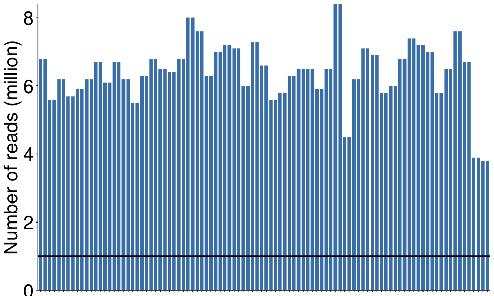
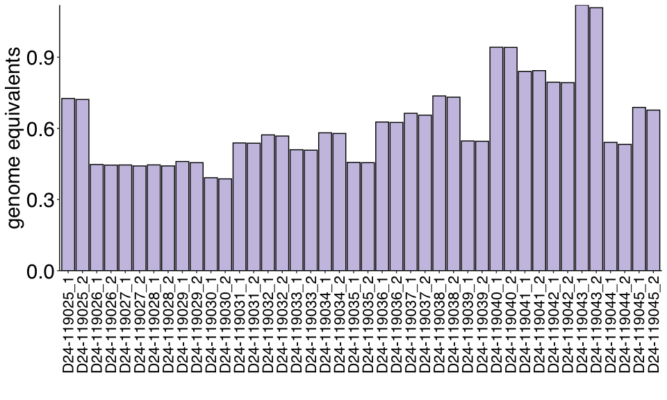
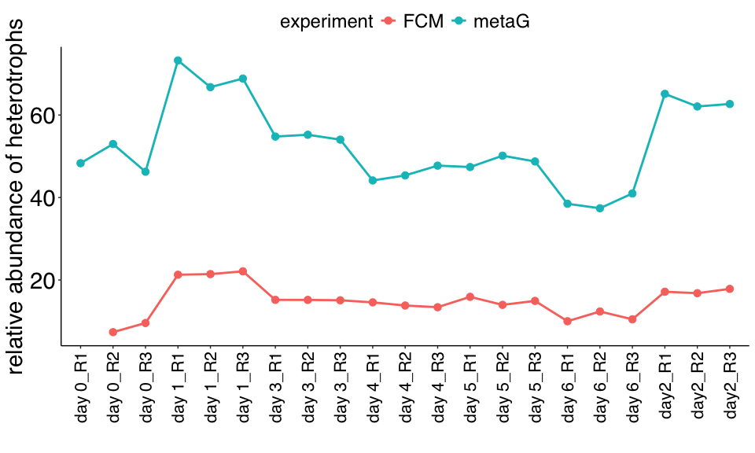
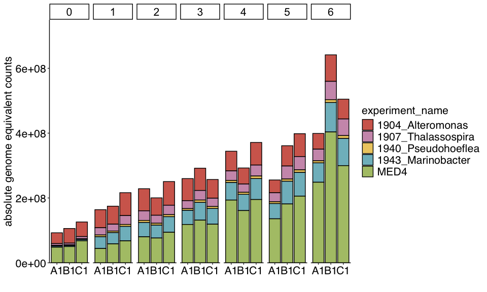
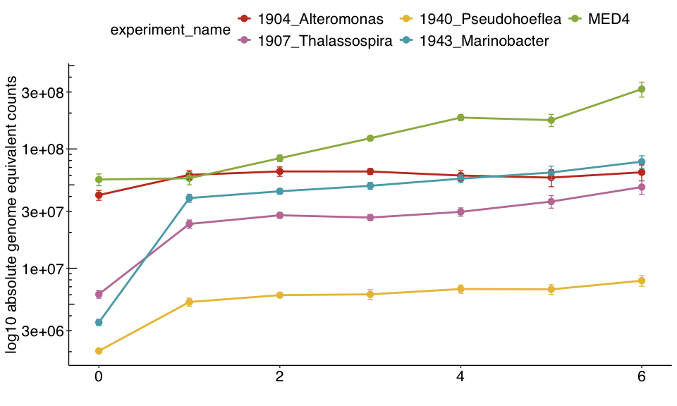
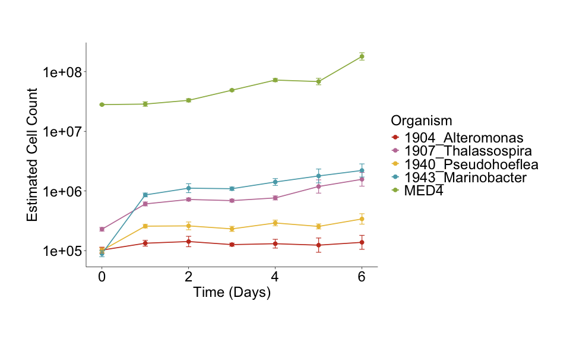

cleaned_comm_dyn_metaG_code
================
2024-10-28

##### 1. Load Packages

``` r
library(ggplot2)
library(ggsci)
library(dplyr)
```

    ## 
    ## Attaching package: 'dplyr'

    ## The following objects are masked from 'package:stats':
    ## 
    ##     filter, lag

    ## The following objects are masked from 'package:base':
    ## 
    ##     intersect, setdiff, setequal, union

``` r
library(scales)
library(pheatmap)
library(viridis)
```

    ## Loading required package: viridisLite

    ## 
    ## Attaching package: 'viridis'

    ## The following object is masked from 'package:scales':
    ## 
    ##     viridis_pal

``` r
library(tidyplots)
library(readxl)
```

##### 2. Define Functions for QC Checks

``` r
##### 1. Plot Total DNA Reads in each sequenced sample #####
plot_total_dna_reads<- function(input_dna_reads_file) {
  
  # Load File #
  fastqc <- read.csv(file = input_dna_reads_file)
  fastqc$sequences_millions <- as.numeric(fastqc$sequences_millions)
  
  # Plot Data #
  fastqc_check<- ggplot(fastqc, aes(x=Sample.Name,y=sequences_millions)) + 
    geom_bar(stat="identity",position = 'dodge',color='white',fill='#4682B4')+
    theme_classic()+
    theme(axis.text.x = element_blank(),
          axis.text.y = element_text(family = "Helvetica",color='black',size=28),
          axis.title.x = element_blank(),
          axis.title.y = element_text(family = "Helvetica",color='black',size=28),
          legend.text = element_text(family = "Helvetica",size = 28),
          legend.title = element_text(family = "Helvetica",size = 28),
          strip.text = element_text(color='Black', size = 28),
          panel.border=element_blank(),
          legend.position='top')+
    ylab("Number of reads (million)")+
    geom_hline(yintercept = 1, color = "black", linetype = "solid", linewidth = 1) +
    scale_y_continuous(expand = c(0, 0))
  return(fastqc_check)
}


##### 2. Plot number of internal DNA standards recovered #####
plot_dna_standards<- function(dna_standards_file) {
  # Load File #
  dna_standards <- read.csv(file = dna_standards_file)
  dna_standards_graph<- ggplot(dna_standards, aes(x=sample_name,y=`genome_equivalents`)) + 
    geom_bar(stat="identity",position = 'dodge',color='black',fill='#CBC3E3')+
    theme_classic()+
    theme(axis.text.x = element_text(angle = 90,hjust=0.9,vjust=0.5,family = "Helvetica",color='black',size=16),
          axis.text.y = element_text(family = "Helvetica",color='black',size=22),
          axis.title.x = element_text(family = "Helvetica",color='black',size=22),
          axis.title.y = element_text(family = "Helvetica",color='black',size=22),
          legend.text = element_text(family = "Helvetica",size = 22),
          legend.title = element_text(family = "Helvetica",size = 22),
          strip.text = element_text(color='Black', size = 22),
          panel.border=element_blank(),
          legend.position='top')+
    xlab("")+
    ylab("genome equivalents")+
    scale_y_continuous(expand = c(0, 0))
  return(dna_standards_graph)
}

##### 2. Plot number of internal DNA standards recovered #####
plot_metaG_FCM_comparison<- function(fcm_counts_file) {
  # Load File #
  fcm_counts <- read.csv(file = fcm_counts_file)
  
  fcm_scatter<-ggplot(fcm_counts, aes(x=new_name,y=het_ratio,fill=experiment,color=experiment))+
    geom_line(aes(group=experiment),size=1)+
    geom_point(size=3)+
    #geom_errorbar(aes(ymin = mean_absolute_counts - se_y, ymax = mean_absolute_counts + se_y), width = 0.06,size=0.5)+  # Error bar layer
    theme_classic()+
    theme(axis.text.x = element_text(angle = 90,hjust=0.9,vjust=0.5,family = "Helvetica",color='black',size=16),
          #axis.text.x = element_text(family = "Helvetica",color='black',size=16),
          axis.text.y = element_text(family = "Helvetica",color='black',size=22),
          axis.title.x = element_text(family = "Helvetica",color='black',size=22),
          axis.title.y = element_text(family = "Helvetica",color='black',size=22),
          legend.text = element_text(family = "Helvetica",size = 18),
          legend.title = element_text(family = "Helvetica",size = 18),
          strip.text = element_text(color='Black', size = 22),
          panel.border=element_blank(),
          legend.position='top')+
    xlab("")+
    ylab("relative abundance of heterotrophs")
    #facet_grid(cols=vars(experiment_day),scales="free",space="free")
    #scale_color_manual(values = alpha(c("#ff3145","#eb91e3","#4f2c7f",
    #                                    "#007bc0","#00e674","#ff7f00","#cbbbc2")))+
    #scale_y_log10(limits = c(50000, 100000000))+
    #annotation_logticks(sides="l")
  return(fcm_scatter)
}
```

##### 2. Generate QC Plots

``` r
##### Define Input Files #####
input_dna_reads_file='dna_community_dynamics_data.csv'
dna_standards_file='dna_standard_reads_mapped.csv'
fcm_counts_file = 'fcm_metaG_comparison.csv'

##### 1. Generate Total DNA Reads Plot #####
##### QC for Sequencing Data #####
dna_counts_plot<- plot_total_dna_reads(input_dna_reads_file)
dna_counts_plot
```

<!-- -->

``` r
##### Generate Number of Recovered DNA Standards #####
##### QC for Sequencing Data #####
internal_standard_plot <- plot_dna_standards(dna_standards_file)
internal_standard_plot
```

<!-- -->

``` r
##### FCM vs metaG Comparison #####
##### QC for comparing heterotroph vs Pro Reads - without extraction efficiency #####
fcm_metaG_plot <- plot_metaG_FCM_comparison(fcm_counts_file)
```

    ## Warning: Using `size` aesthetic for lines was deprecated in ggplot2 3.4.0.
    ## ℹ Please use `linewidth` instead.
    ## This warning is displayed once every 8 hours.
    ## Call `lifecycle::last_lifecycle_warnings()` to see where this warning was
    ## generated.

``` r
fcm_metaG_plot
```

    ## Warning: Removed 1 row containing missing values or values outside the scale range
    ## (`geom_line()`).

    ## Warning: Removed 1 row containing missing values or values outside the scale range
    ## (`geom_point()`).

<!-- -->

##### 3. Define Functions for Read Mapping Results

``` r
##### 1. Plot the Genome Equivalents in the community over time - Stacked Bar Chart #####
plot_read_map_results<- function(read_map_results_file,cluster_colors) {
  input_read_mapping <- read.csv(file = read_map_results_file)
  input_read_mapping <- input_read_mapping%>% filter(experiment_name != 'Thermus_standard')
  metaG_plot<- ggplot(input_read_mapping, aes(x=replicate,y=`absolute_counts`,fill=experiment_name)) + 
    geom_bar(position="stack", stat="identity",alpha=0.8,color='black')+
    theme_classic()+
    theme(axis.text.x = element_text(family = "Helvetica",color='black',size=16),
          axis.text.y = element_text(family = "Helvetica",color='black',size=16),
          axis.title.x = element_text(family = "Helvetica",color='black',size=16),
          axis.title.y = element_text(family = "Helvetica",color='black',size=16),
          legend.text = element_text(family = "Helvetica",size = 16),
          legend.title = element_text(family = "Helvetica",size = 16),
          strip.text = element_text(color='Black', size = 16),
          panel.border=element_blank(),
          legend.position='right')+
    xlab("")+
    #ylab("relative abundance (%)")+
    ylab("absolute genome equivalent counts")+
    scale_fill_manual(values = cluster_colors,guide = guide_legend(ncol = 1, byrow = TRUE))+
    #scale_fill_manual(values = alpha(c("#ff3145","#eb91e3","#4f2c7f","#007bc0","#00e674","#ff7f00","#cbbbc2")))+
    #scale_fill_lancet()+
    facet_grid(cols=vars(sampling_day),scales="free",space="free")+
    #geom_hline(yintercept = 1, color = "black", linetype = "solid", size = 1) +
    scale_y_continuous(limits = c(0, 750000000),expand = c(0, 0))
  return(metaG_plot)
}

##### 2. Plot the Genome Equivalents in the community over time - Line Plot #####
plot_read_map_results_lineplot<- function(read_map_results_file,cluster_colors) {
  # Load File #
  input_read_mapping <- read.csv(file = read_map_results_file)
  
  # Average results of input #
  averaged_data <- input_read_mapping %>%
    group_by(sampling_day,experiment_name,groupings) %>%
    summarise(mean_absolute_counts = mean(absolute_counts),
              se_y = sqrt(var(absolute_counts) / n()),
              .groups = 'drop') %>%
    as.data.frame()
  
  averaged_data <- averaged_data%>% filter(experiment_name != 'Thermus_standard')

  scatterplot_version<-ggplot(averaged_data, aes(x=sampling_day,y=mean_absolute_counts,fill=experiment_name,color=experiment_name))+
    geom_line(aes(group=experiment_name),size=1)+
    geom_point(size=3)+
    geom_errorbar(aes(ymin = mean_absolute_counts - se_y, ymax = mean_absolute_counts + se_y), width = 0.06,size=0.5)+  # Error bar layer
    theme_classic()+
    theme(axis.text.x = element_text(family = "Helvetica",color='black',size=16),
          axis.text.y = element_text(family = "Helvetica",color='black',size=16),
          axis.title.x = element_text(family = "Helvetica",color='black',size=16),
          axis.title.y = element_text(family = "Helvetica",color='black',size=16),
          legend.text = element_text(family = "Helvetica",size = 16),
          legend.title = element_text(family = "Helvetica",size = 16),
          strip.text = element_text(color='Black', size = 16),
          panel.border=element_blank(),
          legend.position='top')+
    xlab("")+
    #ylab("relative abundance (%)")+
    ylab("log10 absolute genome equivalent counts")+
    scale_color_manual(values = cluster_colors)+
    guides(color = guide_legend(nrow = 2))+
    scale_y_log10(limits = c(2000000, 400000000))+
    annotation_logticks(sides="l")
  
    #facet_grid(rows=vars(experiment_name),scales = 'free_y')
    #scale_y_continuous(limits = c(0, 30000000),labels = scales::comma_format(scale = 1e-7))
  return(scatterplot_version)
}

##### 3. Extraction Efficiency Comparison #####
lineplot_extraction_efficiency<- function(read_map_results_file,cluster_colors) {
  input_read_mapping <- read.csv(file = read_map_results_file)
  
  # Obtain the FCM Counts from Day 0 #
  extract_input <- input_read_mapping%>% filter(sampling_day == '0')
  extract_input$initial_FCM_cell_count_added <- as.numeric(extract_input$initial_FCM_cell_count_added)
  
  # Calculate extraction efficiency on Day 0 #
  extract_input$extraction_efficiency <- (extract_input$genome_equivalents / extract_input$initial_FCM_cell_count_added)
  
  # Obtain the average extraction efficiency per organism during the experiment #
  averaged_extraction_efficiency <- extract_input %>%
    group_by(sampling_day,experiment_name) %>%
    summarise(mean_extraction_efficiency = mean(extraction_efficiency),
              #se_y = sqrt(var(extraction_efficiency) / n()),
              .groups = 'drop') %>%
    as.data.frame()
  mini_averaged_extraction_efficiency <- subset(averaged_extraction_efficiency, select = c(experiment_name,mean_extraction_efficiency))
  
  merged_efficiency_df <- merge(input_read_mapping, mini_averaged_extraction_efficiency, by = "experiment_name")
  
  # Calculate relative counts
  merged_efficiency_df <- merged_efficiency_df %>%
    mutate(corrected_genome_recovery = genome_recovery / genome_recovery[sampling_day == '0'])
  
  # Correct for the relative extraction efficiency compared to each microbe in community #
  merged_efficiency_df$corrected_extraction_efficiency <- (merged_efficiency_df$mean_extraction_efficiency * merged_efficiency_df$corrected_genome_recovery)
  
  # Obtain corrected counts #
  merged_efficiency_df$extraction_efficiency_corrected_counts <- (merged_efficiency_df$genome_equivalents / merged_efficiency_df$corrected_extraction_efficiency)
  
  # Average the results to obtain corrected extraction efficiency counts #
  averaged_data <- merged_efficiency_df %>%
    group_by(sampling_day,experiment_name,groupings) %>%
    summarise(mean_absolute_counts = mean(extraction_efficiency_corrected_counts),
              se_y = sqrt(var(extraction_efficiency_corrected_counts) / n()),
              .groups = 'drop') %>%
    as.data.frame()
  
  merged_efficiency_df <- merged_efficiency_df%>% filter(experiment_name != 'Thermus_standard')
  
  # Plot the extraction efficiency corrected counts #
  scatterplot_version <- merged_efficiency_df %>%
      tidyplot(x=sampling_day,y=extraction_efficiency_corrected_counts,color=experiment_name,dodge_width = 0)%>%
      add_mean_line(linewidth=0.6) %>%
      add_mean_dot(size=2) %>%
      #add_barstack_relative()%>%
      #add_mean_dot(size=2) %>%
      add_sem_errorbar(dodge_width = NULL,width=0.6,linewidth=0.4) %>%
      adjust_y_axis(title = "Estimated Cell Count",transform = "log10") %>%
      #adjust_y_axis(title = "Estimated Cell Count") %>%
      adjust_x_axis(title = "Time (Days)") %>%
      adjust_colors(new_colors = cluster_colors) %>%
      adjust_font(fontsize = 18, color = "black") %>%
      adjust_size(width = 130, height = 100, unit = "mm") %>%
      adjust_legend_title("Organism")
  return(scatterplot_version)
}
```

##### 3. Generate Read Mapping Plots

``` r
##### Define Input Files #####
read_map_results_file='community_dynamics_data_readmap_normalized_absolute_counts.csv'
input_read_mapping <- read.csv(file = read_map_results_file)
head(input_read_mapping)
```

    ##   X Unnamed..0                          organism read_count sample_name
    ## 1 0        107                  Alteromonas_1904    7317905  D24-119025
    ## 2 1        105                Thalassospira_1907    1231819  D24-119025
    ## 3 2        102                 Marinobacter_1943     724384  D24-119025
    ## 4 3        104                Pseudohoeflea_1940     402601  D24-119025
    ## 5 4        106                              MED4    3574733  D24-119025
    ## 6 5        103 Thermus_thermophilus_ATCC_BAA_163      72531  D24-119025
    ##   genome_size genome_equivalents    experiment_name replicate sampling_day
    ## 1     4921157         1.48702937   1904_Alteromonas        A1            0
    ## 2     4827886         0.25514666 1907_Thalassospira        A1            0
    ## 3     4800114         0.15090975  1943_Marinobacter        A1            0
    ## 4     4522713         0.08901759 1940_Pseudohoeflea        A1            0
    ## 5     1657990         2.15606427               MED4        A1            0
    ## 6     2143708         0.03383437   Thermus_standard        A1            0
    ##   genome_recovery absolute_counts groupings initial_FCM_cell_count_added
    ## 1        4.47e-08      33263964.7      hets                     9.00E+04
    ## 2        4.47e-08       5707479.5      hets                     1.80E+05
    ## 3        4.47e-08       3375761.5      hets                     9.00E+04
    ## 4        4.47e-08       1991270.6      hets                     9.00E+04
    ## 5        4.47e-08      48229878.5       pro                     2.50E+07
    ## 6        4.47e-08        756854.7      hets                     9.00E+04

``` r
##### Define Color Scheme #####
cluster_colors <- c(`1904_Alteromonas`= '#c63c26',`1907_Thalassospira`= '#C17DA5',`1940_Pseudohoeflea`='#EAC043',
                    `1943_Marinobacter`= '#59a9b7',`Thermus_standard`= '#ff7f00',`MED4`='#9ab54d')

##### 1. Generate Total DNA Reads Plot #####
read_map_plot<- plot_read_map_results(read_map_results_file,cluster_colors)
read_map_plot
```

<!-- -->

``` r
##### 2. Generate Metagenomic Distribution - without extraction efficiency #####
read_map_lineplot<- plot_read_map_results_lineplot(read_map_results_file,cluster_colors)
read_map_lineplot
```

<!-- -->

``` r
##### 3. Generate Metagenomic Distribution - accounting for Extraction Efficiency #####
extraction_efficiency_corrected_lineplot<- lineplot_extraction_efficiency(read_map_results_file,cluster_colors)
extraction_efficiency_corrected_lineplot
```

<!-- -->

``` r
#write.csv(extraction_efficiency_corrected_lineplot, "test_comm_dyn_data.csv", row.names = FALSE)

##### Save Files as SVGs #####
#Cairo(file = "comm_dyn_metaG_overview_barchart_v2.svg", type = "svg", width = 40, height = 20, units = "in", dpi = 250)
#print(read_map_plot)  # 'final_graph' is the ggplot object
#dev.off()

#Cairo(file = "comm_dyn_metaG_overview_lineplot.svg", type = "svg", width = 40, height = 20, units = "in", dpi = 250)
#print(read_map_lineplot)  # 'final_graph' is the ggplot object
#dev.off()

#Cairo(file = "comm_dyn_metaG_extraction_efficiency.svg", type = "svg", width = 40, height = 25, units = "in", dpi = 200)
#print(extraction_efficiency_plot)  # 'final_graph' is the ggplot object
#dev.off()
```
