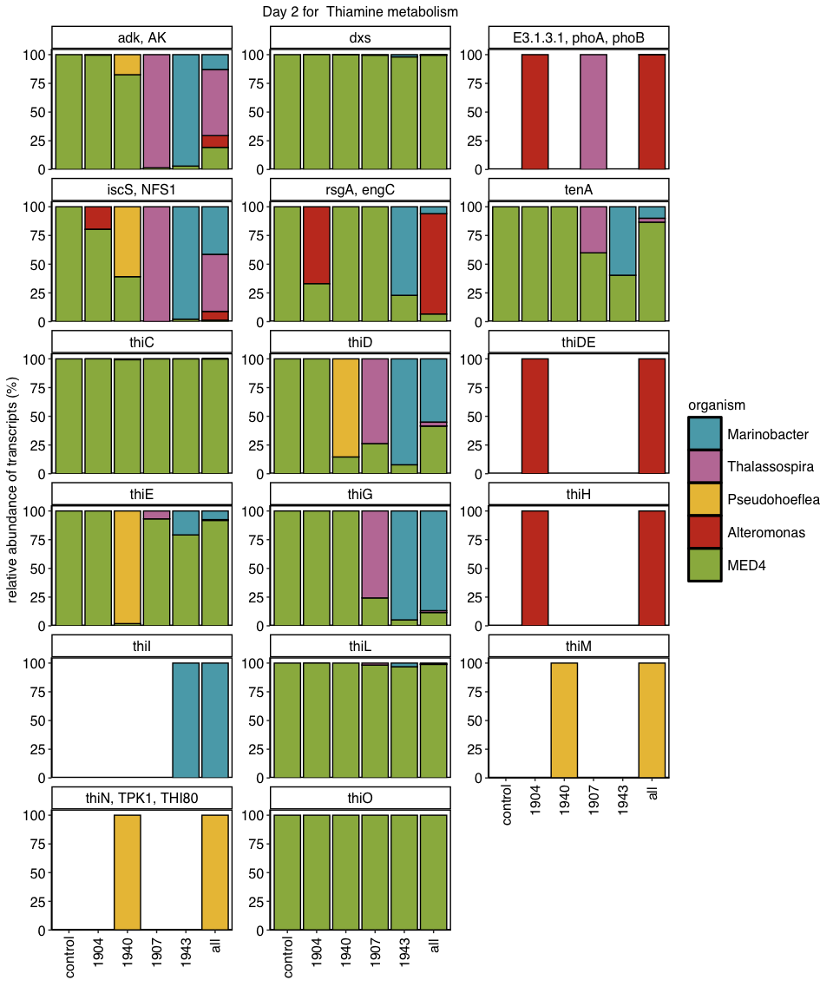
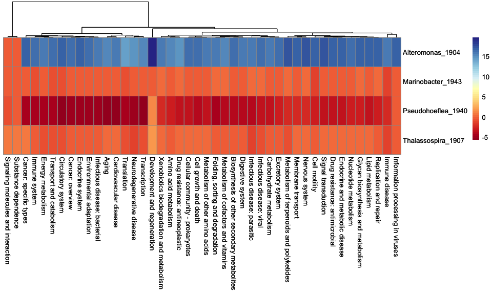
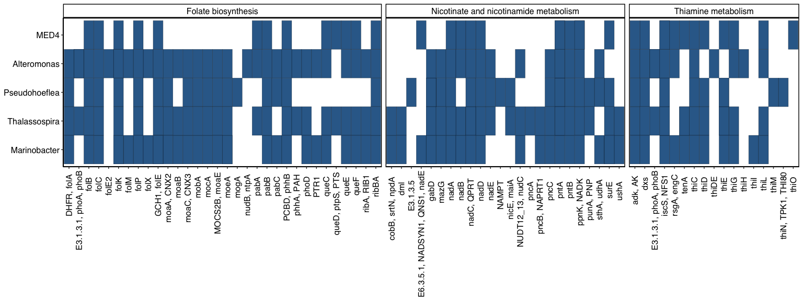

04_absolute_RNA_analysis
================
2025-09-20

##### 1. Load Packages

``` r
library(ggplot2)
library(ggrepel)
library(hexbin)
library(dplyr)
```

    ## 
    ## Attaching package: 'dplyr'

    ## The following objects are masked from 'package:stats':
    ## 
    ##     filter, lag

    ## The following objects are masked from 'package:base':
    ## 
    ##     intersect, setdiff, setequal, union

``` r
library(tidyr)
library(stringr)
library(cowplot)
library(pheatmap)
library(matrixStats)
```

    ## 
    ## Attaching package: 'matrixStats'

    ## The following object is masked from 'package:dplyr':
    ## 
    ##     count

``` r
library(forcats)
library(tidyplots)
```

    ## 
    ## Attaching package: 'tidyplots'

    ## The following object is masked from 'package:cowplot':
    ## 
    ##     save_plot

``` r
library(edgeR)
```

    ## Loading required package: limma

``` r
library(Cairo)
library(KEGGREST)
library(readxl)
library(RColorBrewer)
library(pheatmap)
library(tibble)
```

##### 2. Load Files

``` r
# Define Input Files and Variables #

# Load Annotations #
annotation_file <- 'updated_comm_dyn_annotations_v2.xlsx'
annotations <- read_excel(annotation_file)

# Load Updated KEGG Pathway #
# This key was created by taking the gene pathways from KEGG API #
kegg_gene_key <- 'KEGG_KO_with_PathwayHierarchy.csv'
kegg_key <- read.csv(file = kegg_gene_key)

# Obtain Corrected Cell Counts #
metadata_table <- "updated_FCM_comm_dyn_data.csv"

temp <- read.csv(file = metadata_table)

raw_het_counts <- 'updated_unfcm_corrected_gene_counts.tsv'
```

##### 3. Absolute Abundance - Generate Input Table for plots

``` r
##### This is different than the previous code #####
##### Uses absolute read counts to create gene tables #####

##### 1. Generate Input df #####
make_abs_abund_table <- function(raw_counts,annotations) {
  
  # Load Gene Table #
  het_gene_table <- read.csv(file = raw_counts,sep = '\t')

  # Load Input Files #
  #mini_annotations_df <- subset(annotations, select = c('ID','em_COG_cat','em_KEGG_ko','em_Preferred_name','em_desc'))
  mini_annotations_df <- subset(annotations, select = c('ID','em_COG_cat','updated_gene_name','em_desc','kegg'))
  
  # Convert table to a Long Format #
  df_long <- pivot_longer(het_gene_table, 
                          cols = starts_with("MED4ax_"),
                          names_to = c("experiment_type", "replicate", "sampling_day"),
                          names_pattern = "MED4ax_([\\w\\d]+)_(\\w+)_(DAY\\d+)",
                          values_to = "relative_transcripts_per_cell")
  df_long<- df_long%>% filter(relative_transcripts_per_cell != 0)
  df_long<- df_long%>% filter(sampling_day != 'DAY6')
  
  df_long$sampling_day <- gsub("DAY2", "Day2", df_long$sampling_day)
  df_long$sampling_day <- gsub("DAY4", "Day4", df_long$sampling_day)
  df_long$sampling_day <- gsub("DAY5", "Day5", df_long$sampling_day)
  
  merged_het_file <- merge(df_long, mini_annotations_df, by = "ID")
  
  # Add "_value" to the end of each 'value' where 'category' is "A"
  merged_het_file <- merged_het_file %>%
    mutate(ID = ifelse(organism == "Pseudohoeflea_1940", paste0(ID, "_Pseudohoeflea"), ID))

  return(merged_het_file)
}

##### 2. Normalize transcripts -> transcripts per cell #####
monoxenic_count_analysis<- function(output_abundance_df,metadata_table,sample_day) {
  
  # Load metadata and filter to comparison groups # 
  metadata_table <- read.csv(file = metadata_table)
  metadata_table<- metadata_table%>% filter((experimental_trial != "thalassospira_1"))
  metadata_table<- metadata_table%>% filter(sampling_day == sample_day)
  
  metadata_table$experiment_type <- sapply(strsplit(metadata_table$sample, "_"), function(x) x[2])
  
  merged_data <- merge(output_abundance_df, metadata_table, by = c("sampling_day","replicate","organism","experiment_type"))
  
  # Calculate absolute counts - transcripts per internal standard // FCM corrected cell counts
  merged_data$final_corrected_transcript_counts_per_cell <- (merged_data$relative_transcripts_per_cell / merged_data$FCM_cell_count)

  # Overview Counts #
  grouped_merged_counts <- merged_data %>%
    group_by(ID,organism,sampling_day,kegg,sample,updated_gene_name,replicate,final_corrected_transcript_counts_per_cell,experimental_trial,experiment_type) %>%
    #summarise(.groups = 'drop') %>%
    as.data.frame()
  
  return(grouped_merged_counts)
}

##### 3. Obtaining KEGG Annotations for each gene #####
obtain_kegg_annotations_abs_abundance <- function(data_processing_output_hets,kegg_key) {
  
  subsetted_KEGG_pathway <- subset(data_processing_output_hets, select = c(kegg,organism,ID))
  
  df_clean <- subsetted_KEGG_pathway %>% filter(!is.na(kegg))
  #df_clean$em_KEGG_ko <- trimws(gsub("ko:","",df_clean$em_KEGG_ko))
  #colnames(df_clean)[colnames(df_clean)=="BLAST_kegg_ID"] <- 'em_KEGG_ko'
  colnames(df_clean)[colnames(df_clean)=="kegg"] <- 'em_KEGG_ko'
  df_clean
  
  merged_kegg_annotations <- merge(df_clean, kegg_key, by = "em_KEGG_ko")
  
  # Return Cleaned Tables #
  return(merged_kegg_annotations)
}


##### 4. Calculate Standard Error #####
std_error <- function(x) {
  return(sd(x) / sqrt(length(x)))
}


#sample_day <- 'Day2'
#sample_day <- 'Day4'
sample_day <- 'Day5'

# Obtain parsed df #
output_abundance_df <- make_abs_abund_table(raw_het_counts,annotations)
head(output_abundance_df)
```

    ##                                                     ID         organism
    ## 1 1_1_batch10_bc1018_metaflye_ccs_contig_1_Alteromonas Alteromonas_1904
    ## 2 1_1_batch10_bc1018_metaflye_ccs_contig_1_Alteromonas Alteromonas_1904
    ## 3 1_1_batch10_bc1018_metaflye_ccs_contig_1_Alteromonas Alteromonas_1904
    ## 4 1_1_batch10_bc1018_metaflye_ccs_contig_1_Alteromonas Alteromonas_1904
    ## 5 1_1_batch10_bc1018_metaflye_ccs_contig_1_Alteromonas Alteromonas_1904
    ## 6 1_1_batch10_bc1018_metaflye_ccs_contig_1_Alteromonas Alteromonas_1904
    ##   experiment_type replicate sampling_day relative_transcripts_per_cell
    ## 1            1904         A         Day4                  5.378789e-01
    ## 2            1904         A         Day5                  8.329200e+01
    ## 3            1904         B         Day2                  1.004173e+05
    ## 4            1904         B         Day4                  3.138012e+00
    ## 5            1904         B         Day5                  7.455842e-02
    ## 6            1904         C         Day2                  1.267924e+00
    ##   em_COG_cat updated_gene_name                                   em_desc kegg
    ## 1          S              <NA> COG0724 RNA-binding proteins (RRM domain) <NA>
    ## 2          S              <NA> COG0724 RNA-binding proteins (RRM domain) <NA>
    ## 3          S              <NA> COG0724 RNA-binding proteins (RRM domain) <NA>
    ## 4          S              <NA> COG0724 RNA-binding proteins (RRM domain) <NA>
    ## 5          S              <NA> COG0724 RNA-binding proteins (RRM domain) <NA>
    ## 6          S              <NA> COG0724 RNA-binding proteins (RRM domain) <NA>

``` r
# Normalize gene counts #
monoxenic_df<- monoxenic_count_analysis(output_abundance_df,metadata_table,sample_day)

# Merge with KEGG key #
kegg_monoxenic_abs_key <- obtain_kegg_annotations_abs_abundance(monoxenic_df,kegg_key)
kegg_monoxenic_abs_key <- kegg_monoxenic_abs_key[!duplicated(kegg_monoxenic_abs_key), ]

# Subset df for easier parsing #
mini_monoxenic_abs_count_df <- subset(monoxenic_df, select = c(ID,updated_gene_name,sample,sampling_day,experiment_type,replicate,final_corrected_transcript_counts_per_cell,organism,experimental_trial))

# Create cleaned df ready for plotting #
merged_monoxenic_abs_count_table <- merge(kegg_monoxenic_abs_key, mini_monoxenic_abs_count_df, by = c("ID","organism"))
merged_monoxenic_abs_count_table <- merged_monoxenic_abs_count_table[!duplicated(merged_monoxenic_abs_count_table), ]
merged_monoxenic_abs_count_table <- merged_monoxenic_abs_count_table %>% filter(!is.na(Overview_category))
head(merged_monoxenic_abs_count_table)
```

    ##                ID organism em_KEGG_ko kegg_pathway_id      Overview_category
    ## 1 1_1_MED4_genome     MED4     K02338         ko03440 Replication and repair
    ## 2 1_1_MED4_genome     MED4     K02338         ko03440 Replication and repair
    ## 3 1_1_MED4_genome     MED4     K02338         ko03440 Replication and repair
    ## 4 1_1_MED4_genome     MED4     K02338         ko03440 Replication and repair
    ## 5 1_1_MED4_genome     MED4     K02338         ko03440 Replication and repair
    ## 6 1_1_MED4_genome     MED4     K02338         ko03440 Replication and repair
    ##               pathway_name                                  updated_gene_name
    ## 1 Homologous recombination dnaN; DNA polymerase III subunit beta [EC:2.7.7.7]
    ## 2 Homologous recombination dnaN; DNA polymerase III subunit beta [EC:2.7.7.7]
    ## 3 Homologous recombination dnaN; DNA polymerase III subunit beta [EC:2.7.7.7]
    ## 4 Homologous recombination dnaN; DNA polymerase III subunit beta [EC:2.7.7.7]
    ## 5 Homologous recombination dnaN; DNA polymerase III subunit beta [EC:2.7.7.7]
    ## 6 Homologous recombination dnaN; DNA polymerase III subunit beta [EC:2.7.7.7]
    ##                  sample sampling_day experiment_type replicate
    ## 1    MED4ax_1907_C_DAY5         Day5            1907         C
    ## 2     MED4ax_all_C_DAY5         Day5             all         C
    ## 3    MED4ax_1907_A_DAY5         Day5            1907         A
    ## 4 MED4ax_control_A_DAY5         Day5         control         A
    ## 5     MED4ax_all_A_DAY5         Day5             all         A
    ## 6    MED4ax_1940_A_DAY5         Day5            1940         A
    ##   final_corrected_transcript_counts_per_cell experimental_trial
    ## 1                                0.008881292    thalassospira_2
    ## 2                                0.034839327          community
    ## 3                                0.010229358    thalassospira_2
    ## 4                                0.003272917            control
    ## 5                                0.051157511          community
    ## 6                                0.033999501      pseudohoeflea

##### 4. Gene Pathway Plots

``` r
##### 1. Plot Gene Bar Plots #####
percent_pathway_bar_plot <- function(input_df,abs_gene_plot_title,gene_pathway_category,cluster_colors) {
  
  # Remove extra strings in experiment name #
  input_df$exp_name <- sapply(strsplit(input_df$sample, "_"), function(x) x[2])
  
  # Give genes with no KEGG a hypothetical label #
  subset_cluster_output <- input_df %>% mutate(em_KEGG_ko = if_else(em_KEGG_ko == "", "hypothetical", em_KEGG_ko))
  colnames(subset_cluster_output)[colnames(subset_cluster_output)=="kegg_pathway"] <- 'kegg_pathway_id'
  
  subset_cluster_output<- subset_cluster_output%>% filter(pathway_name == gene_pathway_category)
  
  # Obtain mean transcripts per organism per KEGG gene #
  overview_counts <- subset_cluster_output %>%
    #group_by(Description,ID,organism) %>%
    group_by(em_KEGG_ko,organism,updated_gene_name,exp_name) %>%
    summarise(mean_transcript_counts_per_cell = mean(final_corrected_transcript_counts_per_cell),
              .groups = 'drop') %>%
    as.data.frame()
  
  # Obtain the relative fraction of RNA found in each gene #
  # i.e. if Pro has 9 transcripts for gene A; Marinobacter has 1 transcript for gene A: total transcripts of gene A is 10 #
  # Pro produces 90% of gene A in this sample. Marinobacter produces 10% of gene A in this sample #
  percent_counts <- overview_counts %>%
    group_by(em_KEGG_ko,updated_gene_name,exp_name) %>%
    mutate(total_RNA_per_gene = sum(mean_transcript_counts_per_cell),
          percent_RNA = (mean_transcript_counts_per_cell / total_RNA_per_gene) * 100) %>%
    as.data.frame()
  
  # Rename the samples for pretty visualization #
  percent_counts$organism <- gsub("Alteromonas_1904", "Alteromonas", percent_counts$organism)
  percent_counts$organism <- gsub("Marinobacter_1943", "Marinobacter", percent_counts$organism)
  percent_counts$organism <- gsub("Pseudohoeflea_1940", "Pseudohoeflea", percent_counts$organism)
  percent_counts$organism <- gsub("Thalassospira_1907", "Thalassospira", percent_counts$organism)
  
  # Sort values to desired order #
  percent_counts$exp_name = factor(percent_counts$exp_name, levels=c('control','1904','1940','1907','1943','all'))
  percent_counts$organism = factor(percent_counts$organism, levels=c('Marinobacter','Thalassospira','Pseudohoeflea','Alteromonas','MED4'))
  
  # Remove extra strings in gene name #
  percent_counts$updated_gene_name_clean <- word(percent_counts$updated_gene_name, 1, sep = ";")   
  
  # Plot Bar plot #
  exploratory_bar_plot <- ggplot(percent_counts,aes(x=exp_name,y=percent_RNA,fill=organism)) +
    geom_bar(stat="identity",position='stack',color='black')+
    facet_wrap(updated_gene_name_clean ~., ncol = 3,scales = "free_y") +
    labs(x = "organism", y = "relative abundance of transcripts (%)") +
    theme_classic() +
    ggtitle(abs_gene_plot_title)+
    theme(
      axis.text.x = element_text(family = "Helvetica",color='black',size=12,angle = 90,hjust=0.9,vjust=0.5),
      axis.text.y = element_text(family = "Helvetica",color='black',size=12),
      axis.title.x = element_text(family = "Helvetica",color='black',size=12),
      plot.title = element_text(family = "Helvetica",color='black',size=12,hjust = 0.5),
      axis.title.y = element_text(family = "Helvetica",color='black',size=12),
      strip.text = element_text(family = "Helvetica",color='black',size=12),
      legend.text = element_text(family = "Helvetica",size = 12),
      legend.title = element_text(family = "Helvetica",size = 12),
      legend.key.size = unit(1, "cm"),  # Increase legend key size
      panel.border=element_blank(),
      panel.spacing = unit(0.5, "lines"),
      panel.background = element_rect(colour = "black", size=1),
      legend.position='right')+
    xlab("")+
    scale_fill_manual(values=cluster_colors)+
    scale_y_continuous(limits = c(0,105),expand=c(0,0))

  return(exploratory_bar_plot)
}

### Define Color Scheme ###
cluster_colors <- c(`Alteromonas`= '#c63c26',`Thalassospira`= '#C17DA5',`Pseudohoeflea`='#EAC043',
                    `Marinobacter`= '#59a9b7',`MED4`='#9ab54d',Community='#3a7db8')

### Select the pathway you want to analyze ###
### Since we are looking at every gene associated with a pathway ###
### Recommend just choosing one pathway but you can run on multiple ###

gene_pathway_category <- 'Thiamine metabolism'
#gene_pathway_category <- 'Porphyrin metabolism'
#gene_pathway_category <- 'Lysine biosynthesis'
#gene_pathway_category <- 'Folate biosynthesis'
#gene_pathway_category <- 'Purine metabolism'
#gene_pathway_category <- 'Ribosome'
#gene_pathway_category <- 'Aminoacyl-tRNA biosynthesis'
#gene_pathway_category <- 'Glycerophospholipid metabolism'
#gene_pathway_category <- 'Glycerolipid metabolism'
#gene_pathway_category <- 'Fatty acid biosynthesis'
#gene_pathway_category <- 'Tyrosine metabolism'
#gene_pathway_category <- 'Lysine biosynthesis'
#gene_pathway_category <- 'Histidine metabolism'
#gene_pathway_category <- 'Glycine, serine and threonine metabolism'
#gene_pathway_category <- 'Arginine and proline metabolism'
#gene_pathway_category <- 'Starch and sucrose metabolism'
#gene_pathway_category <- 'Glycolysis / Gluconeogenesis'
#gene_pathway_category <- 'Galactose metabolism'
#gene_pathway_category <- 'Citrate cycle (TCA cycle)'
#gene_pathway_category <- 'Butanoate metabolism'
#gene_pathway_category <- 'Quorum sensing'
#gene_pathway_category <- 'Biofilm formation - Pseudomonas aeruginosa'

# Temp plot label #
temp_abs_gene_title <- "Day 2 for "

abs_gene_plot_title <- paste(temp_abs_gene_title, gene_pathway_category)
#kegg_monoxenic_heatmap_key
monoxenic_pathway_percent_plot <- percent_pathway_bar_plot(merged_monoxenic_abs_count_table,abs_gene_plot_title,gene_pathway_category,cluster_colors)
```

    ## Warning: The `size` argument of `element_rect()` is deprecated as of ggplot2 3.4.0.
    ## ℹ Please use the `linewidth` argument instead.
    ## This warning is displayed once every 8 hours.
    ## Call `lifecycle::last_lifecycle_warnings()` to see where this warning was
    ## generated.

``` r
monoxenic_pathway_percent_plot
```

<!-- -->

##### 5. Absolute Count Heatmap

``` r
##### This script acts as a sanity check that the relative and absolute count data shows the same trends #####
##### This was compared to the 03_analyze_KEGG_pathways het heatmap #####

##### 1. Make df for heatmap #####
df_preparation <- function(df,day) {
  
  # Remove Pro and rename experiments to differentiate between monoxenic and community #
  df<- df%>% filter(organism != 'MED4')
  df$experiment_type <- gsub("1904", "Monoxenic", df$experiment_type)
  df$experiment_type <- gsub("1905", "Monoxenic", df$experiment_type)
  df$experiment_type <- gsub("1907", "Monoxenic", df$experiment_type)
  df$experiment_type <- gsub("1940", "Monoxenic", df$experiment_type)
  df$experiment_type <- gsub("1943", "Monoxenic", df$experiment_type)
  df$experiment_type <- gsub("all", "Community", df$experiment_type)
  df<- df%>% filter(experiment_type != 'control')
  
  # Subset by day #
  df<- df%>% filter(sampling_day == day)
  #df<- df%>% filter(ID == '1_100_batch10_bc1022_metaflye_ccs_contig_1_Marinobacter')

  # Subset data to only include columns of importance #
  mini_df <- subset(df, select=c(Overview_category,ID,organism,replicate,experiment_type,final_corrected_transcript_counts_per_cell))
  cleaned_df <- mini_df[!duplicated(mini_df),]
  
  wide_df <- cleaned_df %>%
      pivot_wider(names_from = (experiment_type),values_from = final_corrected_transcript_counts_per_cell)

  # Remove rows with one or 2 NAs for a specific replicate #
  filtered_df <- wide_df %>% filter(!is.na(Monoxenic) & !is.na(Community))
  
  # Calculate LFC in comm vs monoxenic #
  filtered_df <- filtered_df %>%
      mutate(LFC=log2(filtered_df$Community/filtered_df$Monoxenic))
  
  # Take the mean LFC for each category/organism #
  mean_df <- filtered_df %>%
      group_by(Overview_category,organism) %>%
      summarise(mean_LFC = mean(LFC),
                .groups = 'drop') %>%
    as.data.frame()

  return(mean_df)
}

##### 2. Visualize heatmap #####
generate_abs_heatmap <- function(input_df) {
  
  input_df <- input_df %>% filter(!is.na(Overview_category) & Overview_category != "")
  mini_df <- subset(input_df,select = c(Overview_category,organism,mean_LFC))
  
  # Pivot to wide format (genes as rows, samples as columns)
  wide_heatmap <- mini_df %>%
    pivot_wider(names_from = Overview_category,values_from = mean_LFC) %>%
    column_to_rownames(var = "organism")
  wide_heatmap[is.na(wide_heatmap)] <- 0
  
  colors <- colorRampPalette(brewer.pal(11, "RdYlBu"))(49)
  
  ##### Set the min max LFC so you can observe trends #####
  #breaks <- c(seq(-5, 0, length.out = 25), seq(0, 5, length.out = 24)[-1])
  
  #heatmap <- ggplot(heatmap_counts, aes(Overview_category,organism, fill= median_LFC)) + 
  heatmap <- pheatmap(wide_heatmap,cluster_rows = FALSE,show_colnames = TRUE,
                      clustering_distance_rows = "euclidean", clustering_distance_cols = "euclidean",clustering_method = "ward.D2",
                      #annotation_col = col_annotation,cluster_cols = heatmap$tree_col,
                      annotation_names_col= FALSE,color = colors)
return(heatmap)
}

# Choose the day you want to analyze - make sure it matches the day in step 3 #
#sampling_day <- 'Day2'
#sampling_day <- 'Day4'
sampling_day <- 'Day5'

# Obtain cleaned df ready for heatmap #
cleaning_df <- df_preparation(merged_monoxenic_abs_count_table,sampling_day)
#cleaning_df

# Create Heatmap Plot #
heatmap_plot <- generate_abs_heatmap(cleaning_df)
heatmap_plot
```

<!-- -->

##### 6. Gene Presence Absence Check

``` r
##### 1. Plot presence/absence of genes found within gene pathway #####
plot_kegg_results <- function(kegg_blast_results) {
  
  # Choose pathways of interest #
  # Can add to this as desired #
  filter_df<- kegg_blast_results%>% filter((pathway_name == 'Folate biosynthesis')|(pathway_name == 'Thiamine metabolism')|(pathway_name == 'Nicotinate and nicotinamide metabolism'))
  filter_df$counts <- 1
  
  # Clean up naming for plot #
  filter_df$updated_gene_name_clean <- word(filter_df$updated_gene_name, 1, sep = ";")
  filter_df$organism <- gsub("Alteromonas_1904", "Alteromonas", filter_df$organism)
  filter_df$organism <- gsub("Marinobacter_1943", "Marinobacter", filter_df$organism)
  filter_df$organism <- gsub("Pseudohoeflea_1940", "Pseudohoeflea", filter_df$organism)
  filter_df$organism <- gsub("Thalassospira_1907", "Thalassospira", filter_df$organism)
  
  # Sort organisms #
  filter_df$organism = factor(filter_df$organism, levels=c('Marinobacter','Thalassospira','Pseudohoeflea','Alteromonas','MED4'))
  
  # Plot gene plot #
  kegg_plot <- ggplot(filter_df, aes(x=updated_gene_name_clean, y=organism, fill=counts))+
    geom_tile(color='black')+
    theme_classic()+
    theme(
      axis.text.x = element_text(family = "Helvetica",color='black',size=12,angle = 90,hjust=0.9,vjust=0.5),
      axis.text.y = element_text(family = "Helvetica",color='black',size=12),
      axis.title.x = element_blank(),
      axis.title.y = element_blank(),
      plot.title = element_text(family = "Helvetica",color='black',size=12,hjust = 0.5),
      strip.text = element_text(family = "Helvetica",color='black',size=12),
      legend.text = element_text(family = "Helvetica",size = 12),
      legend.title = element_text(family = "Helvetica",size = 12),
      panel.border=element_blank(),
      panel.background = element_rect(colour = "black", size=1),
      legend.position='none')+
    facet_grid(cols = vars(pathway_name),scales='free',space='free')
  
  return(kegg_plot)
}

# Filter df for plotting #
filtered_df <- select(merged_monoxenic_abs_count_table,-c(final_corrected_transcript_counts_per_cell,sample,sampling_day,sampling_day,experiment_type,replicate,experimental_trial))

# Filter KEGG Gene Key #
cleaned_df <- filtered_df %>%
  distinct() %>%
  filter(pathway_name != "" & !is.na(pathway_name))

kegg_gene_plots<-plot_kegg_results(cleaned_df)
kegg_gene_plots
```

<!-- -->
